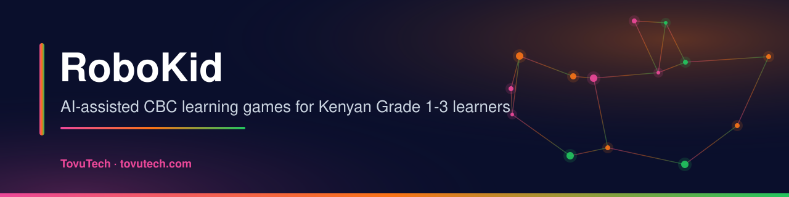
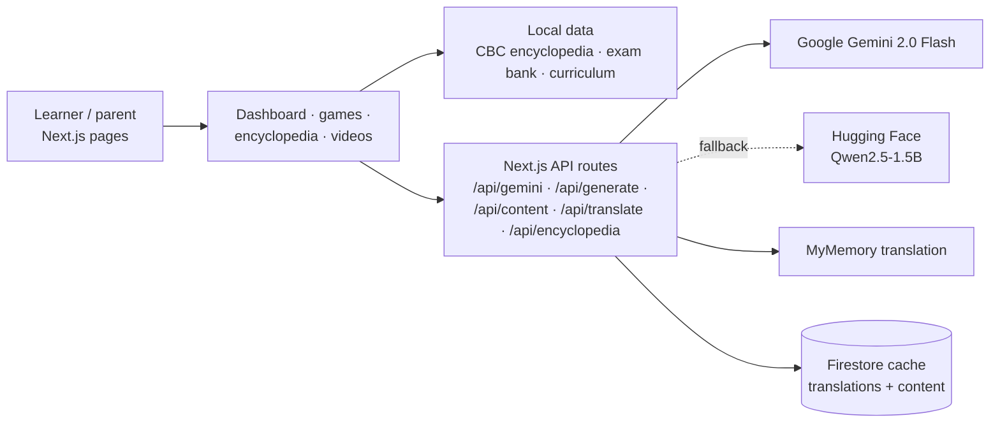

<p align="center">
  
  
  
  
  <a href="https://www.tovutech.com/projects/robokid/"></a>
</p>

## What it is

**RoboKid** is a learning web app prototype for Kenyan children in **Grade 1–3**, built around the KICD Competency-Based Curriculum (CBC). It combines a browsable CBC curriculum reference, practice questions, simple learning games and AI-generated stories and puzzles, with support for English, Kiswahili and three mother tongues.

It is aimed at parents, teachers and young learners, and is an early-stage product: content is curated from public CBC curriculum designs and AI output should be reviewed by a teacher before classroom use.

## What it does

- 📖 **CBC encyclopedia** – about 40 lower-primary sub-strands (Mathematics, Environmental Activities, English, Kiswahili) with learning outcomes, key inquiry questions, suggested activities, competencies, values, assessment criteria and a Kenyan-context note (`src/lib/cbc-encyclopedia.ts`).
- 📝 **Exam bank** – 84 practice questions with answers, explanations and difficulty levels (`src/lib/exam-bank.ts`).
- 🎮 **Games hub** – 10 games: memory match, math race, word scramble, spelling, sequencing, animals, food, colours, counting and story builder.
- 🤖 **AI content** – Gemini 2.0 Flash generates stories, puzzles, quizzes and vocabulary with CBC context; a Hugging Face model (Qwen2.5-1.5B-Instruct) is used as a fallback when an `HF_TOKEN` is set.
- 🌐 **Five languages** – English, Kiswahili, Gĩkũyũ, Dholuo and Somali, using a built-in dictionary, the free MyMemory API (English ↔ Kiswahili) and Gemini; translations are cached in browser storage and Firestore.
- 💻 **Code Lab** – beginner Python lessons with Kenyan examples, in the dashboard.
- ✍️ **Extras** – handwriting practice, a piano, visual maths helper, mother-tongue cards, a videos page and a project playbook.

## How it works



## Tech stack

| Area | Tools |
|---|---|
| Framework | Next.js 16 (App Router), React 19, TypeScript |
| Styling | Tailwind CSS v4 + custom CSS, Google Fonts |
| 3D / visuals | three.js, @react-three/fiber, @react-three/drei; illustrations in `public/` |
| AI | `@google/generative-ai` / Gemini REST API, Hugging Face inference (optional) |
| Translation | Built-in dictionary, MyMemory API, Gemini |
| Data | Firebase Firestore (cache), browser storage |

## Getting started

```bash
git clone https://github.com/jmsmuigai/RoboKid.git
cd RoboKid
npm install
cp .env.local.example .env.local   # then fill in your own keys
npm run dev                         # http://localhost:3000
```

Environment variables (see `.env.local.example`):

| Variable | Needed for |
|---|---|
| `GEMINI_API_KEY` / `GOOGLE_API_KEY` | AI content generation and translation (server-side) |
| `HF_TOKEN` | Optional Hugging Face fallback model |
| `NEXT_PUBLIC_FIREBASE_*` | Firestore cache (public client config) |

The app still runs without keys, but AI generation and cloud caching are then unavailable.

Other scripts: `npm run build`, `npm run start`, `npm run lint`.

### Project structure

```
src/
├── app/
│   ├── page.tsx            # landing page
│   ├── select-grade/       # grade picker
│   ├── dashboard/          # learning hub (lessons, Code Lab, practice)
│   ├── encyclopedia/       # CBC curriculum browser
│   ├── games/              # games hub
│   ├── videos/, playbook/
│   └── api/                # gemini, generate, content, translate, encyclopedia
├── components/             # handwriting, piano, maths helper, mother-tongue cards …
└── lib/                    # cbc-encyclopedia, exam-bank, curriculum-data, translation-service,
                            # content-agent, learning-model, gemini, firebase, constants
```

### Curriculum coverage

| Subject | Strands |
|---|---|
| Mathematics | Numbers, Measurement, Geometry |
| Environmental Activities | Social, Natural, Health / Hygiene |
| English | Listening, Reading, Writing, Comprehension |
| Kiswahili | Kusikiliza, Kusoma, Ufahamu |

## Data & privacy

- Curriculum content is compiled from public KICD CBC curriculum designs and teacher resources (sources listed in `src/lib/cbc-encyclopedia.ts`).
- The app does not ask for children's names or accounts. Translation and generated content may be cached in Firestore; prompts are sent to Google Gemini (and Hugging Face if enabled).
- No personal data is committed to this repository.

## Status & roadmap

**Status:** prototype under active development; not yet piloted in schools.

Possible next steps:
- Teacher review of AI-generated content and of mother-tongue translations.
- Expand the exam bank and add progress tracking for learners.
- Offline / low-bandwidth mode for schools with weak connectivity.
- Add a `LICENSE` file (the previous README stated MIT, but no licence file is included yet).

## Security

See [SECURITY.md](SECURITY.md). Keys belong in `.env.local` or hosting secrets — never in the code.

---

<p align="center">
  <b>Built by James M. Mburu · TovuTech Limited</b><br>
  <a href="https://www.tovutech.com">https://www.tovutech.com</a> · <a href="mailto:intelligence@tovutech.com">intelligence@tovutech.com</a><br>
  📖 Case study: <a href="https://www.tovutech.com/projects/robokid/">tovutech.com/projects/robokid</a>
</p>
